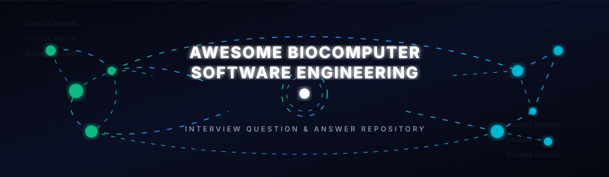

<p align="center">
  
</p>

# 🧠 Awesome Biocomputer Software Engineer Interview Q&A 🔬

<p align="center">
  <a href="https://github.com/ishandutta2007/Awesome-Awesome-Awesome"></a><a href="https://discord.gg/jc4xtF58Ve"></a><a href="https://github.com/ishandutta2007"></a>
</p>

A comprehensive, community-curated collection of **185+ interview questions and answers** for **Biocomputer Software Engineer** roles — professionals who build the software layer interfacing biological computing substrates (organoid intelligence systems, wetware processors, biological neural networks, or hybrid bio-electronic systems) with conventional computing infrastructure, sitting at the intersection of neuroscience/biology, embedded/real-time systems engineering, signal processing, and emerging biocomputing hardware architecture. 🧬💻


---

## 📌 Overview

**Biocomputer Software Engineers** design and implement the software infrastructure connecting biological computing elements to classical computing systems — this includes real-time signal acquisition and preprocessing pipelines, closed-loop stimulation control systems, biological-state inference algorithms, hardware abstraction layers for novel biological computing substrates, and the safety-critical software governing biological computing system operation. 🎛️⚡ The field is genuinely nascent and fast-evolving, sitting at the frontier of neuroscience, organoid biology, bioelectronics, and computer science. 🚀

This repository covers:
- ✅ **Biocomputing Fundamentals**: biological neural networks, organoid intelligence, hybrid bio-electronic systems 🧫
- ✅ **Signal Acquisition**: multi-electrode arrays, electrophysiology, neural signal preprocessing 📊
- ✅ **Real-Time Systems & Embedded Software** for biological computing interfaces ⏰
- ✅ **Closed-Loop Control**: stimulation delivery, feedback algorithms, biological response modeling 🔁
- ✅ **Biological State Inference**: spike sorting, population coding, decoding algorithms 🧬
- ✅ **Software Architecture** for novel, non-deterministic biological computing substrates 🏗️
- ✅ **Safety-Critical Software** considerations for systems interfacing with living biology ⚠️
- ✅ **Ethical, Regulatory, & Industry Context** for this frontier field ⚖️

* ⏱️ **Estimated preparation time:** 30–50 hours
* 📅 **Interview duration:** Typically 4–6 rounds, often including a systems design round and a signal processing/algorithms coding round

---

## 📚 Repository Structure

```
Awesome-Biocomputer-Software-Engineer-Interview-QA/
├── README.md
├── CONTRIBUTING.md
├── LICENSE
├── assets/
│   └── banner.svg
├── topics/
│   ├── 01-Biocomputing-Fundamentals.md
│   ├── 02-Signal-Acquisition-Electrophysiology.md
│   ├── 03-Real-Time-Systems-Embedded-Software.md
│   ├── 04-Closed-Loop-Stimulation-Control.md
│   ├── 05-Biological-State-Inference-Decoding.md
│   ├── 06-Software-Architecture-Biological-Substrates.md
│   ├── 07-Data-Management-Provenance.md
│   ├── 08-Safety-Critical-Software.md
│   ├── 09-Ethics-Regulatory-Governance.md
│   ├── 10-Cross-Functional-Collaboration.md
│   ├── 11-Troubleshooting-Case-Studies.md
│   └── 12-Industry-Context-Field-Trajectory.md
├── docs/
│   ├── glossary.md
│   ├── resources.md
│   └── roadmap.md
└── .gitignore
```

---

## 🎯 Topic Breakdown

| # | Topic | Focus Area | Q&A Count |
|---|-------|-----------|-----------|
| 01 | 🧫 Biocomputing Fundamentals | Biological neural networks, organoid intelligence, wetware | 16 |
| 02 | 📊 Signal Acquisition & Electrophysiology | MEA, LFP/spike recording, amplifier chains, noise | 16 |
| 03 | ⏰ Real-Time Systems & Embedded Software | RTOS, latency requirements, deterministic timing | 16 |
| 04 | 🔁 Closed-Loop Stimulation & Control | Feedback control, stimulation artifact handling | 15 |
| 05 | ⚡ Biological State Inference & Decoding | Spike sorting, population coding, decoding algorithms | 15 |
| 06 | 🏗️ Software Architecture for Biological Substrates | Abstraction layers, non-determinism, adaptive software | 15 |
| 07 | 📁 Data Management & Provenance | Experimental data pipelines, reproducibility, metadata | 14 |
| 08 | ⚠️ Safety-Critical Software | Fail-safes, monitoring, biological system harm avoidance | 14 |
| 09 | ⚖️ Ethics, Regulatory & Governance | Moral status considerations, oversight frameworks | 14 |
| 10 | 🤝 Cross-Functional Collaboration | Working with biologists, neuroscientists, hardware engineers | 13 |
| 11 | 🔍 Troubleshooting & Case Studies | Signal loss, system instability, unexpected biology | 13 |
| 12 | 🚀 Industry Context & Field Trajectory | Landscape, applications, realistic timeline expectations | 13 |
| | **TOTAL** | | **178** |

---

## 🚀 How to Use This Repository

### 📅 Study Plan (6 Weeks)
- 🗓️ **Week 1:** Topics 01–02 (Biocomputing Fundamentals + Signal Acquisition)
- 🗓️ **Week 2:** Topics 03–04 (Real-Time Systems + Closed-Loop Control)
- 🗓️ **Week 3:** Topics 05–06 (Biological State Inference + Software Architecture)
- 🗓️ **Week 4:** Topics 07–08 (Data Management + Safety-Critical Software)
- 🗓️ **Week 5:** Topics 09–10 (Ethics/Regulatory + Cross-Functional Collaboration)
- 🗓️ **Week 6:** Topics 11–12 + Mock Interviews + Review

---

## 📖 Quick Start Example

**From [Topic 06: Software Architecture for Biological Substrates](topics/06-Software-Architecture-Biological-Substrates.md)**

> ❓ **Q: Unlike conventional computing substrates (CPUs, GPUs, FPGAs) which behave deterministically given the same inputs, biological computing elements are fundamentally non-deterministic — their responses vary due to biological variability, drift over time, and state-dependence on factors not under software control. How does this non-determinism fundamentally reshape software architecture requirements compared to conventional hardware-facing software?**
>
> 💡 **A:** Conventional hardware-facing software (e.g., a GPU driver or FPGA interface) can reasonably assume that the same software command to the same hardware will produce the same deterministic output — enabling caching, precomputation, and fixed behavioral contracts between layers. Biological substrates violate this assumption at multiple timescales: moment-to-moment stochasticity at the individual neuron/network level, slower drift in network state over hours-to-days (as the biological system grows, adapts, or fatigues), and abrupt transitions due to biological events (cell death, network reorganization) outside software control. This reshapes architecture requirements toward: adaptive interfaces that continuously monitor and recalibrate their biological-state models rather than assuming fixed hardware behavior; explicit non-determinism-tolerance at every software layer (no layer can assume stable baseline behavior from the biological substrate); robust graceful-degradation rather than hard failure on unexpected substrate behavior; and longitudinal state tracking connecting current biological system behavior to its developmental/adaptation history — architectural patterns with very limited precedent in conventional computing, requiring substantial creative adaptation of established embedded/systems software practice.

---

## 🤝 Contributing

See **[CONTRIBUTING.md](CONTRIBUTING.md)** for guidelines.

**Areas seeking contributions:**
- ⚙️ Closed-loop control algorithm implementation case studies
- 🧬 Spike sorting algorithm comparison deep dives
- 🧠 Organoid intelligence-specific software design case studies
- ⚖️ Ethics/governance framework analysis deep dives

---

## 📜 License
MIT License — see **[LICENSE](LICENSE)**.

---

* 📅 **Last Updated:** August 2026
* 👥 **Contributors:** 1 (growing!)

